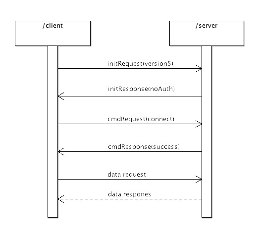

# socks5协议

* Client connects and sends a greeting, which includes a list of authentication methods supported.
    - Server chooses one of the methods (or sends a failure response if none of them are acceptable).
    - Several messages may now pass between the client and the server, depending on the authentication method chosen.
* Client sends a connection request similar to SOCKS4.
    - Server responds similar to SOCKS4.

## 初始化

### 初始化请求

```
+----+----------+----------+
|VER | NMETHODS | METHODS  |
+----+----------+----------+
| 1  |    1     | 1 to 255 |
+----+----------+----------+
```

* VER：协议版本号，对于socks5， VER 是 0x05
* NMETHODS：METHODS 的长度
* METHODS：权限验证方式
    - 0x00: No authentication
    - 0x01: GSSAPI[15]
    - 0x02: Username/password[16]
    - 0x03–0x7F: methods assigned by IANA[17]
    - 0x80–0xFE: methods reserved for private use

### 初始化响应
```
+----+----------+
|VER |  METHOD  |
+----+----------+
| 1  |    1     |
+----+----------+
```
* VER: 协议版本号，1 byte
* METHODS: chosen authentication method, 1 byte, or 0xFF if no acceptable methods were offered

## 用户名/密码方式
当权限验证方式是 0x02: Username/password，就需要使用此协议。

### 请求
* field 1: version number, 1 byte (0x01 for current version of username/password authentication)
* field 2: username length, 1 byte
* field 3: username, 1–255 bytes
* field 4: password length, 1 byte
* field 5: password, 1–255 bytes

### 用户/名密码响应
* field 1: version, 1 byte (0x01 for current version of username/password authentication)
* field 2: status code, 1 byte
    - 0x00: success
    - any other value is a failure, connection must be closed

## CONNECT

### 连接请求
```
+----+-----+-------+------+----------+----------+
|VER | CMD |  RSV  | ATYP | DST.ADDR | DST.PORT |
+----+-----+-------+------+----------+----------+
| 1  |  1  | X'00' |  1   | Variable |    2     |
+----+-----+-------+------+----------+----------+
```

* VER：协议版本号，同样，0x05，1 byte
* CMD：协议类型，1 byte
    - 0x01: establish a TCP/IP stream connection
    - 0x02: establish a TCP/IP port binding
    - 0x03: associate a UDP port
* RSV：保留字节必须为0x00，1 byte
* ATYP：IP地址, 1 byte
    - 0x01: IPv4 address
    - 0x03: Domain name
    - 0x04: IPv6 address
* DST.ADDR：目标地址
    - 4 bytes for IPv4 address
    - 1 byte of name length followed by 1–255 bytes the domain name
    - 16 bytes for IPv6 address
* DST.PORT：目标端口号，2 bytes

### 连接响应
```
+----+-----+-------+------+----------+----------+
|VER | REP |  RSV  | ATYP | DST.ADDR | DST.PORT |
+----+-----+-------+------+----------+----------+
| 1  |  1  | X'00' |  1   | Variable |    2     |
+----+-----+-------+------+----------+----------+
```

* field 1: SOCKS protocol version, 1 byte (0x05 for this version)
* REP: status, 1 byte
    - 0x00: 成功
    - 0x01: general failure
    - 0x02: connection not allowed by ruleset
    - 0x03: network unreachable
    - 0x04: host unreachable
    - 0x05: connection refused by destination host
    - 0x06: TTL expired
    - 0x07: command not supported / protocol error
    - 0x08: address type not supported
* field 3: reserved, must be 0x00, 1 byte
* field 4: address type, 1 byte
    - 0x01: IPv4 address
    - 0x03: Domain name
    - 0x04: IPv6 address
* field 5: server bound address of
    - 4 bytes for IPv4 address
    - 1 byte of name length followed by 1–255 bytes the domain name
    - 16 bytes for IPv6 address
* field 6: server bound port number in a network byte order, 2 bytes

# SS流程




